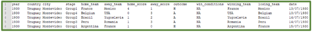
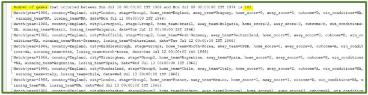
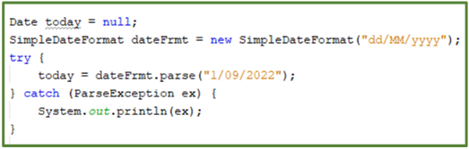
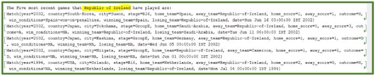
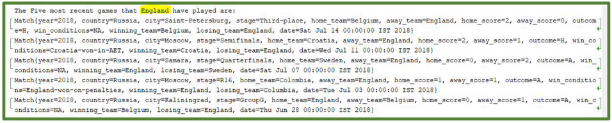
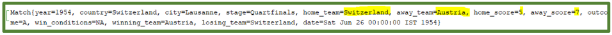


# World Cup Match File Analysis With Threads Java

The FIFA World Cup is a global football competition contested by the various football-playing nations of the world. It is contested every four years and is the most prestigious and important trophy in the sport of football. The first World Cup was held in 1930 in Uruguay with the most recent being held in Russia in 2018. The count down to the start of the FIFA World Cup in Qatar on November 20 is well underway.

The starter code contains a file called *matches.txt* which contains information relating to every single World Cup match played from Uruguay in 1930 to Russia in 2018.

A screen-grab of the first five records in the file (along with column headings are shown below).



The fields in the file are as follows:

***year***: The year the world cup was held.

***county***: The host nation of the competition.

***city***: The city the match is being played in.

***stage***: The stage of the tournament (group stage/quarter final/semi-final etc..) ***home\_team***: The designated home team for the game.

***away\_team***: The designated away team for the game.

***home\_score***: The number of goals scored in the game by the designated home team. ***away\_score***: The number of goals scored in the game by the designated away team.

***win\_conditions***: If the winning team needed AET (added extra time) or penalties to win. Note, a value of NA (not applicable) is present for games that did not require AET or penalties.

***winning\_team:*** The team that has won the game. ***losing\_team:*** The team that has lost the game.

*The game may of course have finished as a draw (tie), in which case, there was no winning or losing team and the value of NA will appear in both of the above columns*.

***date:*** The date the match took place (the date is presented in the format dd/mm/yyyyy - for example 1/9/2022).

In the starter code that is available for this assignment, a *Match* class is provided and models a record from the file.  

A class called *FileIO* is also provided and contains one public method – *readFile*. This method accepts the file name as an argument and will then read each record from the file, convert it to a *Match* object and then add the object to a list. It is this list of *Match* objects that the method returns.

## Tasks

### Task ONE

Write and execute a Callable that will accept three arguments - a list of matches, a start date and an end date. The Callable will then determine and return a **list** of match objects which took place between the start and end date. For example, if the start date is 10/07/1966 and the end date is 8/07/1974 a list with 102 objects would be returned. You must then display the contents of the list on the console and an indication of how many games were played in that period (in this case 102). 



To create a [Date](https://docs.oracle.com/javase/8/docs/api/), the first thing you need to do is to create a [SimpleDateFormat](https://docs.oracle.com/javase/8/docs/api/). You can then use this format to initialize a date object: For example:



### Task TWO

In the starter code, you will notice an array that contains the names of each nation that has participated in the World Cup since its inception.  There are 81 elements/nations in this array. Schedule a Runnable to run every 3 seconds with an initial delay of 2 seconds. The Runnable should generate a random number between 0 and 80 and use this number to subscript the array and select a nation from it. You must then print the percentage of games that the selected nation has won on penalties in the World Cup. For example:

```out
% of games that Republic-of-Ireland has won on penalities 50%
```

```out
% of games that England has won on penalities 25%
```

*You are permitted to move this array to a different location in your solution if you wish.

### Task THREE

Write and execute a Callable that will return a list of the five most recent games that a given nation has played in the World Cup. The list should be ordered so that the most recent games appear first.  You can decide on the type and number of arguments that this Callable accepts yourself.  

For example:





### Task FOUR

Write and execute a Runnable that will accept a single argument – a list of matches. You should then endeavour to identify from this list the match with the highest number of goals scored in Word Cup history (it is a 7-5 win for Austria over Switzerland). You must then print the details of this game to the console.



## Marks

| Task   | Marks    |
|--------|:---------|
| Task 1 | 20 Marks |
| Task 2 | 30 Marks |
| Task 3 | 10 Marks |
| Task 4 | 30 Marks |

**All four tasks are to be submitted to a suitable Executor service and are to run concurrently.**  
